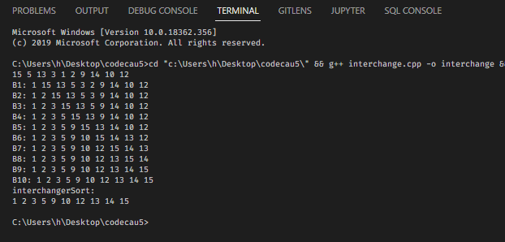

# câu 3




# câu 4:


a)


Cây tìm kiếm nhị phân có giá trị giảm dần từ NODE PHẢI tới NODE GỐC tới NODE TRÁI

- Nghĩa là muốn thêm 1 node vào thì ta xét n với node gốc nếu lớn hơn thì thêm vào bên phải, ngược lại thêm vào bên trái
- Nếu bên bên trái hay bên phải muốn thêm có node rồi thì lấy node đó tiếp tục xét như phía trên cho tới khi node muốn thêm là node lá

b) NRL goc-phai-trai

```cpp
31 19 22 25 9 18 3 8 1 2
```

c) RLN

```cpp
25 22 18 8 2 1 3 9 19 31
```

- cứ tới node nào thì lấy node đó để tiếp tục để xét RLN
